# Web Application Document - Projeto Individual - Módulo 2 - Inteli


## AdaLove Reimaginated

#### Davi Duarte - Ciência da Computação

## Sumário

1. [Introdução](#c1)  
2. [Projeto Técnico da Aplicação Web](#c2)  
3. [Desenvolvimento da Aplicação Web](#c3)  
4. [Referências](#c4)  

## <a name="c1"></a>1. Introdução

Este projeto é uma aplicação web para gerenciamento de cards de atividades do AdaLove, desenvolvido utilizando Node.js com Express.js como framework e PostgreSQL como banco de dados relacional, seguindo o padrão MVC (Model-View-Controller).

A aplicação AdaLove Reimaginated é uma plataforma para gerenciar cartões de atividades de aprendizado de forma prática e eficiente. O sistema permite que alunos do Inteli importem seus cartões de atividades e os gerenciem de uma forma mais simplificada, categorizando-os por tipo, status, instrutor e outras propriedades relevantes.

---

## <a name="c2"></a>2. Projeto da Aplicação Web

A arquitetura do sistema AdaLove Reimaginated segue o padrão MVC (Model-View-Controller), permitindo uma separação clara de responsabilidades e facilitando a manutenção e escalabilidade da aplicação.

### 2.1. Modelagem do banco de dados

A modelagem do banco de dados é o processo de criar uma representação estruturada das informações que serão armazenadas em um sistema de banco de dados. Este processo envolve a identificação das entidades principais, seus atributos e os relacionamentos entre elas, resultando em um esquema que serve como plano para a implementação física do banco de dados.

O modelo relacional do banco de dados da aplicação AdaLove Reimaginated foi projetado para permitir um gerenciamento eficiente das atividades de aprendizado e suas relações com usuários, instrutores e áreas de conhecimento. A estrutura do banco foi implementada usando PostgreSQL e segue os princípios de normalização para evitar redundâncias e garantir a integridade dos dados.

O diagrama abaixo apresenta a estrutura completa do banco de dados com todas as tabelas e seus relacionamentos:

#### Diagrama do banco no dbdiagram.io

<div align="center">
  <sup>Figura 1 - Diagrama do Banco de Dados no dbdiagram.io</sup>
  
  <sup>Fonte: Autoria própria, 2025</sup>
</div>

#### Diagrama do banco no supabase

<div align="center">
  <sup>Figura 2 - Diagrama do Banco de Dados no Supabase</sup>
  
  <sup>Fonte: Autoria própria, 2025</sup>
</div>

Deixei também o modelo do banco de dados no formato **DBML** disponível no arquivo [database-structure.dbml](/documentos/assets/database-structure.dbml)

##### Resumo da Estrutura

- **Users**: Armazena logins e informações dos usuários
- **Sections**: Armazena seções/turmas do AdaLove com informações de projeto e orientador
- **Activities**: Armazena as atividades de cada seção com detalhes como instrutor e data
- **Student Activities**: Relaciona estudantes com atividades, incluindo status e notas de estudo
- **Activity Types**: Tipos de atividades (Orientação, Instrução, Autoestudo, Artefatos)
- **Status Types**: Status possíveis para as atividades (A fazer, Fazendo, Feito)

##### Relações

- Um usuário pode ter várias atividades de estudante (student activities)
- Cada seção pode ter várias atividades
- Cada atividade pode ter vários estudantes associados
- Cada atividade de estudante tem um tipo de atividade e um status
- Cada atividade pertence a uma seção

### 2.1.1 BD e Models

A camada de Models em uma aplicação MVC (Model-View-Controller) é responsável por gerenciar os dados, a lógica e as regras de negócio da aplicação. Ela representa a estrutura de dados subjacente e fornece métodos para interagir com o banco de dados de forma organizada e eficiente. No sistema AdaLove Reimaginated, os models implementados servem como intermediários entre as operações do controlador e o banco de dados PostgreSQL.

Os models são fundamentais para garantir o encapsulamento da lógica de acesso a dados, fornecendo uma API limpa e consistente para o restante da aplicação. Além disso, eles permitem que alterações na estrutura do banco de dados sejam isoladas, minimizando o impacto em outras partes do código.

#### Models Implementados

##### User Model

O `userModel.js` gerencia todas as operações relacionadas aos usuários da aplicação, incluindo:

- **Operações CRUD básicas**: Métodos para criar, ler, atualizar e excluir registros de usuários
- **Autenticação**: Verificação de credenciais de login
- **Relacionamentos**: Recuperação de usuários com seus respectivos cartões associados
- **Gerenciamento de perfil**: Atualização de senha e ícone de perfil

Este model encapsula tanto atributos simples (username, password) quanto relacionamentos mais complexos, como a ligação entre usuários e seus cartões de atividades.

##### Section Model

O `sectionModel.js` gerencia as seções/turmas do AdaLove, fornecendo:

- **Operações CRUD**: Criação, leitura, atualização e exclusão de seções
- **Relacionamentos**: Associação com atividades da seção
- **Importação de dados**: Conversão de dados da plataforma AdaLove oficial
- **Gerenciamento de projetos**: Informações sobre projetos e orientadores

##### Activity Model

O `activityModel.js` gerencia as atividades individuais dentro de cada seção:

- **Operações CRUD**: Criação, leitura, atualização e exclusão de atividades
- **Relacionamentos**: Associação com seções e tipos de atividades
- **Filtragem por semana**: Organização de atividades por número da semana
- **Informações de instrutor**: Dados sobre instrutores responsáveis

##### Student Activity Model

O `studentActivityModel.js` é o núcleo funcional da aplicação, gerenciando a relação entre estudantes e atividades:

- **Operações CRUD**: Criação, leitura, atualização e exclusão de atividades de estudante
- **Filtragem avançada**: Busca com múltiplos critérios (status, tipo, data, semana)
- **Estatísticas**: Agregação de informações sobre atividades (total, por status, obrigatórias)
- **Notas de estudo**: Perguntas e respostas de estudo personalizadas
- **Avaliações**: Sistema de notas e feedback
- **Importação em lote**: Conversão de dados da plataforma AdaLove oficial

Este model implementa lógica complexa para classificação e manipulação de atividades, incluindo operações em lote para importação de dados externos.

#### Funcionalidades Destacadas

##### No User Model

- **Autenticação segura**: Verificação de credenciais com hash de senhas usando bcrypt
- **Gerenciamento de perfil**: Atualização de informações pessoais e senhas
- **Relacionamentos**: Associação com atividades de estudante através de foreign keys

##### No Student Activity Model

- **getActivitiesByFilters**: Sistema flexível de filtragem que suporta múltiplos critérios (status, tipo, data, semana, instrutor)
- **getStudentActivityStats**: Agregação de estatísticas sobre atividades para análise rápida do progresso do usuário
- **bulkDeleteActivities**: Operação em lote para exclusão de múltiplas atividades
- **getChartsData**: Dados formatados para gráficos com filtros por semana

##### No Section Model

- **importFromAdaLove**: Funcionalidade sofisticada que mapeia dados externos da plataforma AdaLove oficial para o formato interno do sistema
- **getActivitiesBySection**: Recupera todas as atividades associadas a uma seção específica

##### No Activity Model

- **Relacionamentos complexos**: Associação com seções, tipos de atividades e atividades de estudante
- **Filtragem por semana**: Organização temporal das atividades por número da semana

Os models implementados seguem boas práticas de programação, como encapsulamento de lógica de negócios, separação de responsabilidades e consultas SQL parametrizadas para prevenir injeções SQL. Esta abordagem estruturada facilita a manutenção, extensão e teste do sistema, além de proporcionar uma base sólida para a expansão futura das funcionalidades.

### 2.2. Arquitetura

A arquitetura do sistema AdaLove Reimaginated segue o padrão MVC (Model-View-Controller) adaptado para uma aplicação web moderna com frontend e backend separados. O backend utiliza Node.js com Express.js seguindo o padrão MVC tradicional, enquanto o frontend é uma Single Page Application (SPA) desenvolvida em React.js que consome a API REST do backend. Esta arquitetura promove a separação de responsabilidades em camadas distintas, tornando o código mais organizado, reutilizável e manutenível.

#### Diagrama de Arquitetura MVC

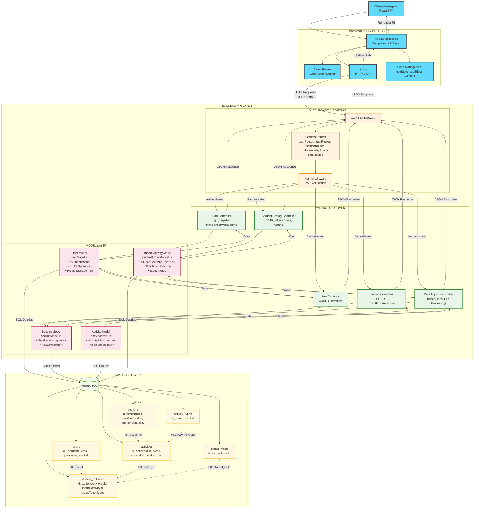

#### Explicação do Fluxo de Dados

1. **Frontend React Application**

- O usuário interage com a interface React.js no navegador
- React Router gerencia a navegação client-side entre as diferentes páginas
- Estado da aplicação é gerenciado através de hooks do React (useState, useEffect, Context)

2. **Comunicação Frontend-Backend**

- Axios é utilizado para fazer requisições HTTP para a API REST do backend
- As requisições são feitas em formato JSON
- JWT tokens são enviados nos headers para autenticação

3. **Middleware e Roteamento (Backend)**

- CORS middleware permite requisições cross-origin do frontend React
- Middleware de autenticação verifica tokens JWT antes de processar as requisições
- Sistema de rotas do Express direciona para os controladores apropriados

4. **Controladores (Backend)**

- Os controladores recebem as requisições roteadas e são responsáveis por:
- Extrair e validar dados da requisição
- Coordenar a interação entre o Model e a View
- Implementar a lógica de negócio específica da aplicação

5. **Models (Backend)**

- Os Models encapsulam todas as operações relacionadas aos dados:
  - Comunicação com o banco de dados PostgreSQL
  - Implementação das regras de negócio associadas aos dados
  - Validação de dados antes da persistência
  - Transformação de dados entre o formato do banco e o formato da aplicação

6. **Banco de Dados**

- O PostgreSQL armazena todos os dados persistentes da aplicação
- As tabelas principais incluem: Users, Sections, Activities, Student Activities, Activity Types e Status Types

7. **Resposta ao Cliente**

- Após processar a requisição e interagir com o modelo, o controlador:
  - Para requisições de API: formata e envia respostas JSON
  - Para requisições web: renderiza views HTML ou redireciona o usuário
- A resposta é então enviada de volta ao cliente

#### Componentes Principais

##### Frontend (React.js)

- **React Components**: Componentes reutilizáveis para interface do usuário
- **React Router**: Roteamento client-side para navegação SPA
- **Axios**: Cliente HTTP para comunicação com a API
- **State Management**: Gerenciamento de estado local e global da aplicação

##### Models

- **User Model**: Gerencia operações relacionadas aos usuários
- **Section Model**: Gerencia operações relacionadas às seções/turmas
- **Activity Model**: Gerencia operações relacionadas às atividades
- **Student Activity Model**: Gerencia a relação entre estudantes e atividades

##### Backend (Node.js/Express)

- **Auth Controller**: Gerencia autenticação, autorização e perfil
- **User Controller**: Operações CRUD de usuários
- **Section Controller**: Gerenciamento de seções e importação AdaLove
- **Student Activity Controller**: Gerenciamento completo de atividades, filtros e estatísticas
- **Data Import Controller**: Processamento de importação de dados em background

##### Vantagens desta Arquitetura

- **Separação Frontend-Backend**: Permite desenvolvimento independente das camadas
- **Reutilização**: API REST pode ser consumida por diferentes tipos de clientes
- **Escalabilidade**: Frontend e backend podem ser escalados independentemente
- **Manutenibilidade**: Responsabilidades bem definidas facilitam manutenção
- **Performance**: SPA proporciona experiência de usuário mais fluida
- **Flexibilidade**: Possibilita futuras integrações com mobile apps ou outras interfaces

---

Esta arquitetura proporciona uma separação clara de responsabilidades, facilitando o desenvolvimento, teste e manutenção do sistema. A estrutura modular também permite que cada componente evolua independentemente, desde que as interfaces entre eles permaneçam consistentes.

### 2.3. WebAPI e endpoints

A API do AdaLove Reimaginated fornece uma interface RESTful para interagir com o sistema, permitindo operações como gerenciamento de usuários, autenticação, manipulação de seções, atividades e atividades de estudante, além de importação de dados do AdaLove 1.0. Abaixo estão detalhados todos os endpoints disponíveis, agrupados por área funcional.

#### Endpoints de Autenticação

| Método | Endpoint | Descrição | Protegido por login |
|--------|----------|-----------|-----------|
| `POST` | `/auth/login` | Autentica um usuário e retorna um token JWT | ❌ |
| `POST` | `/auth/register` | Cria um novo usuário no sistema | ❌ |
| `GET` | `/auth/profile` | Obtém o perfil do usuário autenticado | ✅ |
| `PUT` | `/auth/profile` | Atualiza o perfil do usuário autenticado | ✅ |
| `POST` | `/auth/change-password` | Altera a senha do usuário autenticado | ✅ |

#### Detalhes dos Endpoints de Autenticação

##### `POST /auth/login`

- **Descrição**: Autentica um usuário com base no nome de usuário e senha
- **Body**:

  ```json
  {
    "username": "string",
    "password": "string"
  }
  ```

- **Resposta (200)**:

  ```json
  {
    "message": "Authentication successful",
    "token": "string",
    "user": {
      "id": "number",
      "username": "string",
      "iconUrl": "string"
    }
  }
  ```

- **Resposta (401)**: Credenciais inválidas
- **Resposta (400)**: Campos obrigatórios não fornecidos  

##### `POST /auth/register`

- **Descrição**: Registra um novo usuário no sistema
- **Body**:

  ```json
  {
    "username": "string",
    "password": "string",
    "iconUrl": "string" (opcional)
  }
  ```

- **Resposta (201)**:

  ```json
  {
    "message": "User registered successfully",
    "user": {
      "id": "number",
      "username": "string",
      "iconUrl": "string"
    }
  }
  ```

- **Resposta (409)**: Nome de usuário já existe
- **Resposta (400)**: Campos obrigatórios não fornecidos  

##### `POST /auth/change-password`

- **Descrição**: Altera a senha do usuário autenticado
- **Autenticação**: Requer token JWT válido
- **Body**:
  
  ```json
  {
    "oldPassword": "string",
    "newPassword": "string"
  }
  ```

- **Resposta (200)**:
  
  ```json
  {
    "message": "Password updated successfully"
  }
  ```

- **Resposta (401)**: Senha antiga incorreta ou token inválido
- **Resposta (400)**: Campos obrigatórios não fornecidos

#### Endpoints de Usuários

| Método | Endpoint | Descrição | Protegida por API Key |
|--------|----------|-----------|-----------|
| `GET` | `/users` | Obtém todos os usuários | ❌ |
| `GET` | `/users/:id` | Obtém um usuário específico por ID | ❌ |
| `POST` | `/users` | Cria um novo usuário | ✅ |
| `PUT` | `/users/:id` | Atualiza um usuário existente | ✅ |
| `DELETE` | `/users/:id` | Remove um usuário | ✅ |
| `PATCH` | `/users/:id/icon` | Atualiza apenas o ícone de um usuário | ✅ |

##### `GET /users`

- **Descrição**: Retorna uma lista de todos os usuários
- **Autenticação**: Requer token JWT válido
- **Resposta (200)**:
  
  ```json
  [
    {
      "id": "number",
      "username": "string",
      "iconUrl": "string"
    }
  ]
  ```

##### `GET /users/:id`

- **Descrição**: Retorna os detalhes de um usuário específico
- **Autenticação**: Requer token JWT válido
- **Parâmetros**:
  - `id` (path): ID do usuário
- **Resposta (200)**:
  
  ```json
  {
    "id": "number",
    "username": "string",
    "iconUrl": "string"
  }
  ```

- **Resposta (404)**: Usuário não encontrado

##### `PATCH /users/:id/icon`

- **Descrição**: Atualiza apenas o ícone de um usuário
- **Autenticação**: Requer token JWT válido
- **Parâmetros**:
  - `id` (path): ID do usuário
- **Body**:
  
  ```json
  {
    "iconUrl": "string"
  }
  ```

- **Resposta (200)**:

  ```json
  {
    "id": "number",
    "username": "string",
    "iconUrl": "string"
  }
  ```

- **Resposta (404)**: Usuário não encontrado

#### Endpoints de Atividades de Estudante (Student Activities)

Estes endpoints servem para os usuários gerenciarem suas atividades de estudo

| Método | Endpoint | Descrição |
|--------|----------|-----------|
| `GET` | `/student-activities` | Obtém todas as atividades de estudante |
| `GET` | `/student-activities/user/:userId` | Obtém atividades de um usuário específico |
| `GET` | `/student-activities/filters` | Obtém atividades com base em filtros |
| `GET` | `/student-activities/stats` | Obtém estatísticas das atividades do usuário |
| `GET` | `/student-activities/charts-data` | Obtém dados para gráficos |
| `GET` | `/student-activities/:id` | Obtém uma atividade específica por ID |
| `POST` | `/student-activities` | Cria uma nova atividade de estudante |
| `PUT` | `/student-activities/:id` | Atualiza uma atividade de estudante |
| `PATCH` | `/student-activities/:id/status` | Atualiza apenas o status de uma atividade |
| `DELETE` | `/student-activities/:id` | Remove uma atividade de estudante |
| `DELETE` | `/student-activities/bulk-delete` | Remove múltiplas atividades |
| `GET` | `/student-activities/activity-types` | Obtém todos os tipos de atividade |
| `GET` | `/student-activities/status-types` | Obtém todos os tipos de status |

#### Endpoints de Seções (Sections)

| Método | Endpoint | Descrição |
|--------|----------|-----------|
| `GET` | `/sections` | Obtém todas as seções |
| `GET` | `/sections/:id` | Obtém uma seção específica por ID |
| `POST` | `/sections` | Cria uma nova seção |
| `PUT` | `/sections/:id` | Atualiza uma seção |
| `DELETE` | `/sections/:id` | Remove uma seção |
| `GET` | `/sections/:id/activities` | Obtém atividades de uma seção |
| `POST` | `/sections/import-adalove` | Importa dados do AdaLove 1.0 |

#### Endpoints de Importação de Dados (Data Import)

| Método | Endpoint | Descrição |
|--------|----------|-----------|
| `POST` | `/data/import` | Inicia importação de arquivo |
| `GET` | `/data/import-status/:jobId` | Obtém status de importação |
| `GET` | `/data/statistics` | Obtém estatísticas de importação |
| `GET` | `/data/import-history` | Obtém histórico de importações |
| `POST` | `/data/cancel-import/:jobId` | Cancela uma importação |

#### Detalhes dos Principais Endpoints

As rotas mais importantes do sistema AdaLove 2.0 são documentadas abaixo com exemplos completos de requisição e resposta.

##### `POST /auth/login` ⭐ **ROTA CRÍTICA**

- **Descrição**: Autentica um usuário no sistema usando email e senha
- **Autenticação**: Não requerida
- **Body**:

  ```json
  {
    "email": "usuario@exemplo.com",
    "password": "minhasenha123"
  }
  ```

- **Resposta (200)**:

  ```json
  {
    "message": "Authentication successful",
    "token": "eyJhbGciOiJIUzI1NiIsInR5cCI6IkpXVCJ9...",
    "user": {
      "id": "550e8400-e29b-41d4-a716-446655440000",
      "email": "usuario@exemplo.com",
      "username": "meuusuario",
      "iconUrl": "https://exemplo.com/avatar.jpg"
    }
  }
  ```

- **Resposta (401)**: `{"message": "Invalid credentials"}`
- **Resposta (400)**: `{"message": "Email and password are required"}`

##### `POST /auth/register` ⭐ **ROTA CRÍTICA**

- **Descrição**: Registra um novo usuário no sistema
- **Autenticação**: Não requerida
- **Body**:

  ```json
  {
    "username": "novousuario",
    "email": "novo@exemplo.com",
    "password": "senhasegura123",
    "iconUrl": "https://exemplo.com/avatar.jpg" // opcional
  }
  ```

- **Resposta (201)**:

  ```json
  {
    "message": "User registered successfully",
    "token": "eyJhbGciOiJIUzI1NiIsInR5cCI6IkpXVCJ9...",
    "user": {
      "id": "550e8400-e29b-41d4-a716-446655440001",
      "username": "novousuario",
      "email": "novo@exemplo.com",
      "iconUrl": "https://exemplo.com/avatar.jpg"
    }
  }
  ```

- **Resposta (409)**: `{"message": "Username already exists"}` ou `{"message": "Email already exists"}`
- **Resposta (400)**: `{"message": "Username, email and password are required"}`

##### `GET /student-activities/filters` ⭐ **ROTA MAIS USADA**

- **Descrição**: Retorna atividades de estudante com filtros avançados - principal endpoint para listagem
- **Autenticação**: Requer token JWT válido
- **Parâmetros de Consulta** (todos opcionais):
  - `activityTypeId`: ID do tipo de atividade (1-4)
  - `statusTypeId`: ID do status (1=A fazer, 2=Fazendo, 3=Feito)
  - `mandatory`: Filtra por obrigatoriedade (`true`/`false`)
  - `weekNumber`: Número da semana (1-16)
  - `instructorName`: Nome do instrutor (busca parcial)
  - `search`: Termo de busca geral (nome ou descrição)
  - `limit`: Limite de registros (padrão: sem limite)
  - `offset`: Offset para paginação (padrão: 0)

- **Exemplo de Requisição**:

  ```
  GET /api/student-activities/filters?statusTypeId=1&weekNumber=3&limit=10&offset=0
  ```

- **Resposta (200)**:

  ```json
  [
    {
      "id": "550e8400-e29b-41d4-a716-446655440002",
      "studentActivityUuid": "abc123def456",
      "userId": "550e8400-e29b-41d4-a716-446655440000",
      "activityId": "550e8400-e29b-41d4-a716-446655440003",
      "statusTypeId": 1,
      "activityNotes": "Minhas anotações de estudo",
      "activityRating": 4,
      "weightValue": 8.5,
      "studyQuestion": "Como implementar autenticação JWT?",
      "studyAnswer": "Usando bibliotecas como jsonwebtoken...",
      "activityName": "Implementação de API REST",
      "activityDescription": "Desenvolver endpoints para autenticação",
      "instructorName": "Prof. João Silva",
      "mandatory": true,
      "activityDate": "2024-01-15T10:00:00.000Z",
      "weekNumber": 3,
      "basicActivityURL": "https://adalove.inteli.edu.br/activity/123",
      "statusName": "A fazer",
      "statusIconUrl": "/images/icons/todo.png",
      "activityTypeName": "Autoestudo",
      "activityTypeIconUrl": "/images/icons/self-study.png",
      "sectionCaption": "Módulo 2 - Desenvolvimento Web"
    }
  ]
  ```

##### `GET /student-activities/stats` ⭐ **ROTA CRÍTICA**

- **Descrição**: Retorna estatísticas agregadas das atividades do usuário autenticado
- **Autenticação**: Requer token JWT válido
- **Resposta (200)**:

  ```json
  {
    "total": 45,
    "completed": 28,
    "inProgress": 12,
    "pending": 5,
    "mandatory": 32,
    "totalWeeks": 8
  }
  ```

##### `GET /student-activities/charts-data` ⭐ **ROTA IMPORTANTE**

- **Descrição**: Retorna dados formatados para gráficos e visualizações
- **Autenticação**: Requer token JWT válido
- **Parâmetros de Consulta**:
  - `weekFilter`: Filtro por semana (`all` ou número da semana)

- **Exemplo de Requisição**:

  ```
  GET /api/student-activities/charts-data?weekFilter=all
  ```

- **Resposta (200)**:

  ```json
  {
    "weeklyProgress": [
      {
        "weeknumber": 1,
        "total": "8",
        "completed": "6",
        "inprogress": "2",
        "pending": "0"
      },
      {
        "weeknumber": 2,
        "total": "10",
        "completed": "8",
        "inprogress": "1",
        "pending": "1"
      }
    ],
    "typeDistribution": [
      {
        "activitytype": "Autoestudo",
        "count": "15",
        "completed": "12"
      },
      {
        "activitytype": "Orientação",
        "count": "8",
        "completed": "7"
      }
    ],
    "monthlyTrend": [
      {
        "month": "2024-01-01T00:00:00.000Z",
        "total": "18",
        "completed": "14"
      }
    ]
  }
  ```

##### `PATCH /student-activities/:id/status` ⭐ **ROTA CRÍTICA**

- **Descrição**: Atualiza apenas o status de uma atividade específica
- **Autenticação**: Requer token JWT válido
- **Parâmetros**:
  - `id` (path): UUID da atividade de estudante
- **Body**:

  ```json
  {
    "statusTypeId": 3
  }
  ```

- **Resposta (200)**:

  ```json
  {
    "id": "550e8400-e29b-41d4-a716-446655440002",
    "statusTypeId": 3,
    "statusName": "Feito",
    "activityName": "Implementação de API REST",
    "updatedAt": "2024-01-15T14:30:00.000Z"
  }
  ```

- **Resposta (404)**: `{"error": "Student activity not found"}`
- **Resposta (400)**: `{"error": "Status type ID is required"}`

##### `POST /data/import` ⭐ **ROTA ESPECIALIZADA**

- **Descrição**: Inicia importação de arquivo JSON do AdaLove 1.0 com processamento em background
- **Autenticação**: Requer token JWT válido
- **Rate Limiting**: 5 requisições por 15 minutos por IP
- **Content-Type**: `multipart/form-data`
- **Body**: Arquivo JSON (campo `file`)
- **Validações**:
  - Tamanho máximo: 10MB
  - Formato: JSON válido
  - Estrutura: AdaLove 1.0 oficial
  - MIME type: `application/json`

- **Resposta (200)**:

  ```json
  {
    "message": "Import started successfully",
    "jobId": "import_550e8400-e29b-41d4-a716-446655440004",
    "estimatedRecords": 156
  }
  ```

- **Resposta (400)**:

  ```json
  {
    "message": "Invalid AdaLove 1.0 data structure",
    "errors": ["Missing 'folders' section", "Invalid activity format"]
  }
  ```

##### `GET /data/import-status/:jobId` ⭐ **ROTA DE MONITORAMENTO**

- **Descrição**: Obtém status em tempo real de um job de importação
- **Autenticação**: Requer token JWT válido
- **Parâmetros**:
  - `jobId` (path): ID do job de importação

- **Resposta (200)**:

  ```json
  {
    "id": "import_550e8400-e29b-41d4-a716-446655440004",
    "status": "processing",
    "progress": 78,
    "totalRecords": 156,
    "processedRecords": 122,
    "startedAt": "2024-01-15T10:00:00.000Z",
    "estimatedCompletion": "2024-01-15T10:05:30.000Z",
    "errors": []
  }
  ```

- **Status possíveis**: `pending`, `processing`, `completed`, `failed`, `cancelled`

##### `GET /student-activities/activity-types` ⭐ **ROTA DE REFERÊNCIA**

- **Descrição**: Retorna todos os tipos de atividade disponíveis
- **Autenticação**: Requer token JWT válido
- **Resposta (200)**:

  ```json
  [
    {
      "id": 1,
      "name": "Orientação",
      "iconUrl": "/images/icons/presentation.png"
    },
    {
      "id": 2,
      "name": "Instrução",
      "iconUrl": "/images/icons/instruction.png"
    },
    {
      "id": 3,
      "name": "Autoestudo",
      "iconUrl": "/images/icons/self-study.png"
    },
    {
      "id": 4,
      "name": "Artefatos",
      "iconUrl": "/images/icons/other.png"
    }
  ]
  ```

##### `GET /student-activities/status-types` ⭐ **ROTA DE REFERÊNCIA**

- **Descrição**: Retorna todos os tipos de status disponíveis
- **Autenticação**: Requer token JWT válido
- **Resposta (200)**:

  ```json
  [
    {
      "id": 1,
      "name": "A fazer",
      "iconUrl": "/images/icons/todo.png"
    },
    {
      "id": 2,
      "name": "Fazendo",
      "iconUrl": "/images/icons/doing.png"
    },
    {
      "id": 3,
      "name": "Feito",
      "iconUrl": "/images/icons/done.png"
    }
  ]
  ```

#### Segurança

Todos os endpoints, exceto `/auth/login` e `/auth/register`, requerem autenticação via token JWT. O token deve ser incluído no cabeçalho da requisição no formato:

```txt
Authorization: Bearer <token>
```

As respostas de erro seguem um formato consistente:

```json
{
  "error": "Mensagem descritiva do erro",
  "message": "Detalhe adicional opcional"
}
```

##### `GET /auth/profile` ⭐ **ROTA IMPORTANTE**

- **Descrição**: Obtém o perfil completo do usuário autenticado
- **Autenticação**: Requer token JWT válido
- **Resposta (200)**:

  ```json
  {
    "id": "550e8400-e29b-41d4-a716-446655440000",
    "username": "meuusuario",
    "email": "usuario@exemplo.com",
    "iconUrl": "https://exemplo.com/avatar.jpg"
  }
  ```

- **Resposta (404)**: `{"message": "User not found"}`

##### `PUT /auth/profile` ⭐ **ROTA IMPORTANTE**

- **Descrição**: Atualiza o perfil do usuário autenticado
- **Autenticação**: Requer token JWT válido
- **Body**:

  ```json
  {
    "username": "novousername",
    "iconUrl": "https://exemplo.com/novo-avatar.jpg"
  }
  ```

- **Resposta (200)**:

  ```json
  {
    "message": "Profile updated successfully",
    "user": {
      "id": "550e8400-e29b-41d4-a716-446655440000",
      "username": "novousername",
      "email": "usuario@exemplo.com",
      "iconUrl": "https://exemplo.com/novo-avatar.jpg"
    }
  }
  ```

- **Resposta (400)**: `{"message": "Username already taken"}` ou `{"message": "Username is required"}`

##### `DELETE /student-activities/bulk-delete` ⭐ **ROTA ESPECIALIZADA**

- **Descrição**: Remove todas as atividades do usuário autenticado (usado para limpeza de dados)
- **Autenticação**: Requer token JWT válido
- **Resposta (200)**:

  ```json
  {
    "message": "All activities deleted successfully",
    "deletedCount": 45
  }
  ```

##### `POST /sections/import-adalove` ⭐ **ROTA ESPECIALIZADA**

- **Descrição**: Importa dados de seção específica do AdaLove 1.0
- **Autenticação**: Requer token JWT válido
- **Body**:

  ```json
  {
    "sectionData": {
      "sectionUuid": "abc123def456",
      "sectionCaption": "Módulo 2 - Desenvolvimento Web",
      "projectUuid": "proj123",
      "activities": [...]
    }
  }
  ```

- **Resposta (201)**:

  ```json
  {
    "message": "Section imported successfully",
    "section": {
      "id": "550e8400-e29b-41d4-a716-446655440005",
      "sectionUuid": "abc123def456",
      "sectionCaption": "Módulo 2 - Desenvolvimento Web",
      "activitiesCount": 12
    }
  }
  ```

#### Padrões de Resposta e Códigos HTTP

Todas as rotas seguem padrões consistentes de resposta e utilizam códigos HTTP apropriados:

- **200**: Sucesso
- **201**: Recurso criado
- **400**: Requisição inválida
- **401**: Não autorizado
- **404**: Recurso não encontrado
- **409**: Conflito
- **500**: Erro interno do servidor

#### Resumo das Rotas por Importância

**🔴 Rotas Críticas (Essenciais para funcionamento básico):**

- `POST /auth/login` - Autenticação de usuários
- `POST /auth/register` - Registro de novos usuários
- `GET /student-activities/filters` - Listagem principal de atividades
- `PATCH /student-activities/:id/status` - Atualização de status
- `GET /student-activities/stats` - Estatísticas do dashboard

**🟡 Rotas Importantes (Funcionalidades principais):**

- `GET /auth/profile` - Perfil do usuário
- `PUT /auth/profile` - Atualização de perfil
- `GET /student-activities/charts-data` - Dados para gráficos
- `GET /student-activities/activity-types` - Tipos de atividade
- `GET /student-activities/status-types` - Tipos de status

**🟢 Rotas Especializadas (Funcionalidades avançadas):**

- `POST /data/import` - Importação de dados AdaLove 1.0
- `GET /data/import-status/:jobId` - Monitoramento de importação
- `DELETE /student-activities/bulk-delete` - Limpeza de dados
- `POST /sections/import-adalove` - Importação de seções

#### Autenticação e Segurança

- **JWT Token**: Todas as rotas protegidas requerem token JWT no header `Authorization: Bearer <token>`
- **Rate Limiting**: Importação de dados limitada a 5 requisições por 15 minutos
- **Validação**: Todos os inputs são validados e sanitizados
- **CORS**: Configurado para aceitar requisições de `localhost:3000` e `localhost:3001`
- **Middleware**: Autenticação aplicada automaticamente em todas as rotas protegidas

Esta API fornece uma interface completa para gerenciar todos os aspectos do sistema AdaLove 2, permitindo operações robustas de CRUD para usuários, seções, atividades e atividades de estudante, além de funcionalidades especializadas como importação de dados do AdaLove 1.0, análise estatística e processamento em background.

### 2.7 Interface e Navegação

O frontend do AdaLove 2.0 foi desenvolvido utilizando Next.js com React, implementando uma interface moderna que segue os princípios de design fluent com efeitos glassmorphism. A aplicação utiliza as cores da marca AdaLove (ada-red #E30614 e ada-accent #F24444) e oferece uma experiência de usuário intuitiva e responsiva.

#### 2.7.1 Página de Login

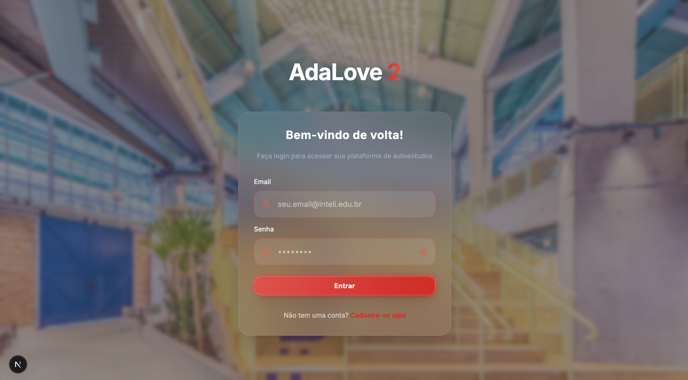

**Funcionalidade:** A página de login serve como ponto de entrada principal do sistema, permitindo que usuários autentiquem-se usando email e senha.

**Features Principais:**

- Formulário de autenticação com campos de email e senha
- Validação em tempo real dos campos obrigatórios
- Botão de login com feedback visual durante o carregamento
- Link direto para página de registro
- Design glassmorphism com elementos transparentes e backdrop blur
- Layout responsivo que se adapta a diferentes tamanhos de tela

**Benefícios para o Usuário:**

- Interface limpa e intuitiva que reduz a fricção no processo de login
- Feedback imediato sobre erros de validação
- Transição suave entre estados de carregamento
- Acesso rápido ao registro para novos usuários

**Detalhes Técnicos:**

- Componente React implementado em `/client/src/app/login/page.jsx`
- Utiliza a API `POST /auth/login` para autenticação
- Gerenciamento de estado com React hooks (useState, useEffect)
- Armazenamento seguro do token JWT no localStorage
- Redirecionamento automático para dashboard após login bem-sucedido
- Tratamento de erros com mensagens descritivas para o usuário

#### 2.7.2 Página de Registro

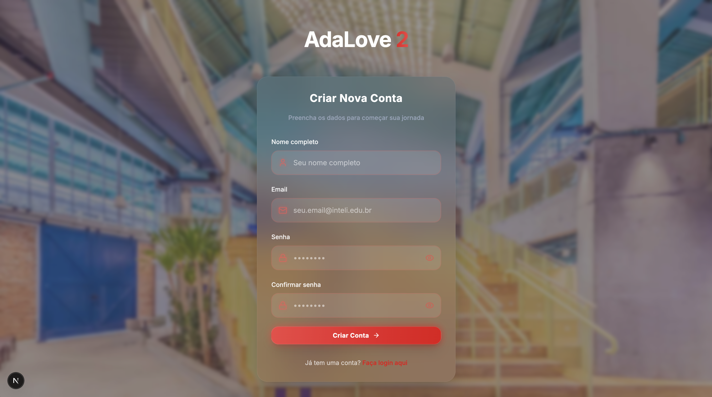

**Funcionalidade:** Interface para criação de novas contas de usuário no sistema AdaLove 2.0.

**Features Principais:**

- Formulário completo com campos para nome, email, senha e confirmação
- Validação robusta incluindo verificação de força da senha
- Confirmação de senha com validação em tempo real
- Campo opcional para URL do avatar do usuário
- Feedback visual para todos os estados de validação
- Design consistente com a página de login

**Benefícios para o Usuário:**

- Processo de registro simplificado e guiado
- Validações que previnem erros comuns
- Criação automática de sessão após registro bem-sucedido
- Interface acessível e fácil de navegar

**Detalhes Técnicos:**

- Implementado em `/client/src/app/register/page.jsx`
- Integração com API `POST /auth/register`
- Validação client-side com verificação de duplicatas no servidor
- Hash seguro de senhas usando bcrypt no backend
- Geração automática de token JWT após registro
- Redirecionamento para dashboard com sessão ativa

#### 2.7.3 Homepage/Dashboard

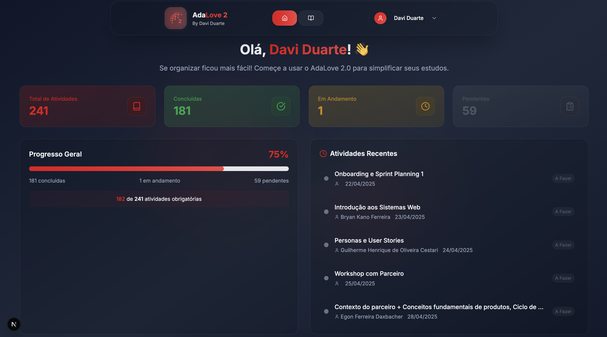

**Funcionalidade:** Dashboard principal que oferece uma visão geral do progresso do usuário e acesso rápido às principais funcionalidades.

**Features Principais:**

- Navbar flutuante com efeito glassmorphism
- Cards de estatísticas mostrando progresso geral (total, concluídas, em progresso, pendentes)
- Seção de atividades recentes com informações resumidas
- Botões de navegação para diferentes seções (Dashboard, Autoestudos)
- Menu de usuário com acesso ao perfil e configurações
- Design responsivo com layout em grid

**Benefícios para o Usuário:**

- Visão panorâmica do progresso acadêmico
- Acesso rápido às atividades mais relevantes
- Navegação intuitiva entre diferentes seções
- Informações importantes sempre visíveis

**Detalhes Técnicos:**

- Componente principal em `/client/src/app/dashboard/page.jsx`
- Utiliza APIs `GET /student-activities/stats` e `GET /student-activities/filters`
- Componentes reutilizáveis para cards de estatísticas
- Estado global gerenciado com Context API
- Atualização automática de dados com useEffect
- Implementação de loading states e error handling

#### 2.7.4 Seleção de Semanas

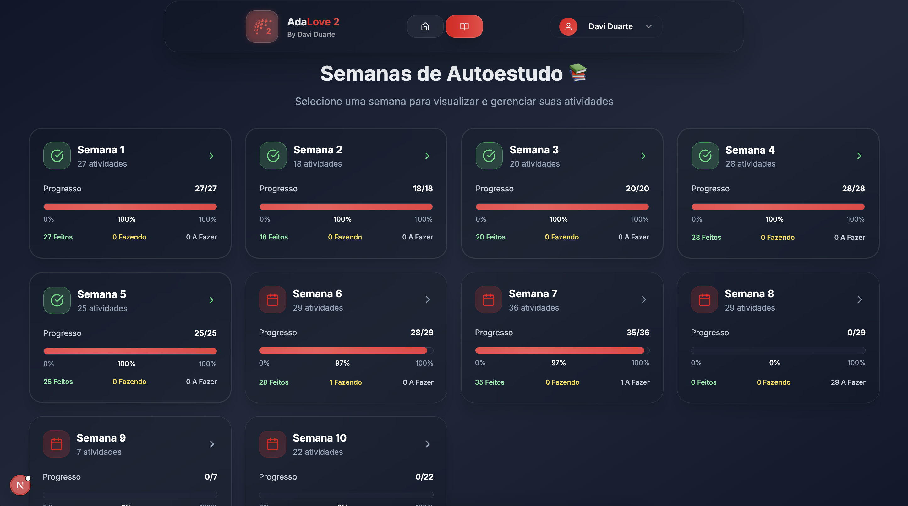

**Funcionalidade:** Interface para navegação e seleção de semanas específicas do curso, permitindo visualização organizada das atividades por período.

**Features Principais:**

- Grid de cards representando cada semana do curso (1-16)
- Indicadores visuais de progresso para cada semana
- Contadores de status (feitas, fazendo, à fazer) em formato de texto limpo
- Bordas coloridas e ícones de check verde para semanas completas
- Design responsivo com cards otimizados para reduzir espaço vazio
- Navegação intuitiva com hover effects

**Benefícios para o Usuário:**

- Visão geral rápida do progresso em todo o curso
- Identificação imediata de semanas com atividades pendentes
- Navegação eficiente para semanas específicas
- Feedback visual claro sobre o status de conclusão

**Detalhes Técnicos:**

- Componente implementado na página de autoestudos
- Utiliza API `GET /student-activities/filters` com filtro por weekNumber
- Cálculo dinâmico de estatísticas por semana
- Componentes reutilizáveis para cards de semana
- Estados de loading e empty state para semanas sem dados

#### 2.7.5 Estado Vazio - Seleção de Semanas

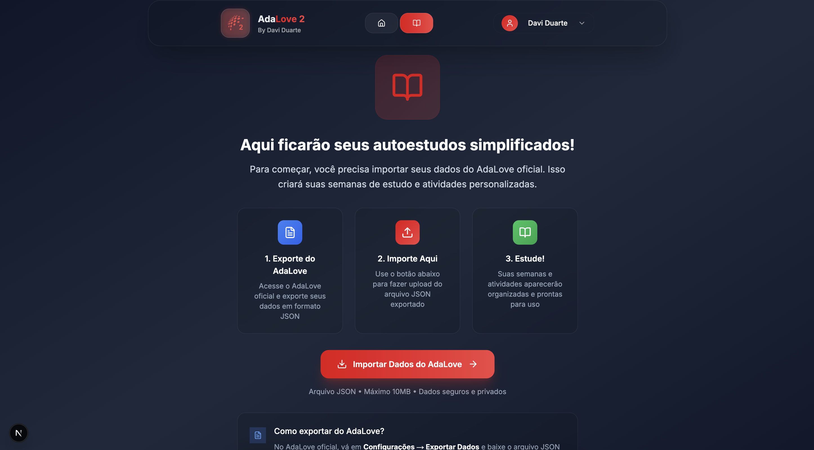

**Funcionalidade:** Página de estado vazio exibida quando não há dados de atividades importados no sistema.

**Features Principais:**

- Mensagem clara explicando a ausência de dados
- Botão de importação proeminente com design destacado
- Instruções visuais para guiar o usuário
- Layout centralizado e limpo
- Integração direta com as configurações de importação

**Benefícios para o Usuário:**

- Orientação clara sobre próximos passos
- Acesso direto à funcionalidade de importação
- Redução da confusão em estados sem dados
- Experiência guiada para novos usuários

**Detalhes Técnicos:**

- Componente de empty state reutilizável
- Redirecionamento para modal de configurações
- Navegação direta para página de gerenciamento de dados
- Verificação automática de dados disponíveis

#### 2.7.6 Página de Semana Específica

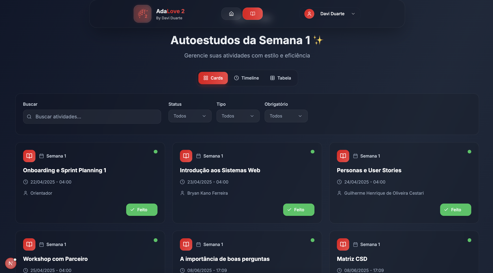

**Funcionalidade:** Visualização detalhada das atividades de uma semana específica com opções de filtro e alternância entre visualizações.

**Features Principais:**

- Barra de filtros horizontais com dropdowns para tipo de atividade e status
- Toggle para alternar entre visualização Timeline e Tabela
- Filtros ativos exibidos abaixo da barra de filtros
- Layout responsivo com componentes bem organizados
- Navegação breadcrumb para contexto de localização

**Benefícios para o Usuário:**

- Filtragem eficiente para encontrar atividades específicas
- Flexibilidade na forma de visualizar os dados
- Interface limpa que não sobrecarrega com informações
- Controle total sobre a experiência de visualização

**Detalhes Técnicos:**

- Implementado em `/client/src/app/selfstudy/page.jsx`
- Gerenciamento de estado para filtros ativos
- Componentes de filtro reutilizáveis
- Persistência de preferências de visualização
- Integração com APIs de filtros avançados

#### 2.7.7 Visualização Timeline

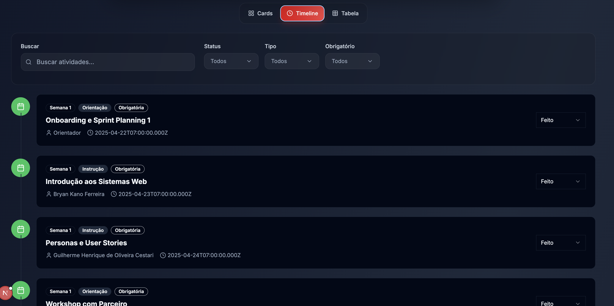

**Funcionalidade:** Visualização cronológica das atividades em formato de timeline vertical, ideal para acompanhar o progresso temporal.

**Features Principais:**

- Cards de atividades com design glassmorphism
- Informações completas: nome, instrutor, data, tipo e status
- Badges coloridos para diferentes tipos de atividade
- Status pills customizados em vez de dropdowns simples
- Layout vertical otimizado para scroll
- Cores e ícones consistentes com o design system

**Benefícios para o Usuário:**

- Visualização natural do fluxo temporal das atividades
- Fácil identificação de padrões e prazos
- Interface visualmente atrativa e moderna
- Informações importantes sempre visíveis

**Detalhes Técnicos:**

- Componente ActivityCard reutilizável
- Renderização otimizada para listas grandes
- Lazy loading para melhor performance
- Integração com sistema de cores da marca AdaLove
- Componentes de status customizados

#### 2.7.8 Visualização em Tabela

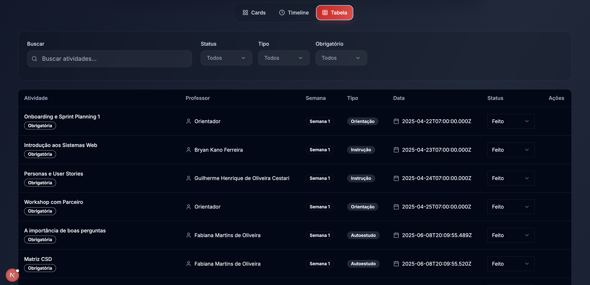

**Funcionalidade:** Visualização estruturada em formato de tabela, ideal para análise comparativa e gestão eficiente de múltiplas atividades.

**Features Principais:**

- Tabela responsiva com colunas organizadas (Nome, Instrutor, Data, Tipo, Status)
- Ordenação por diferentes critérios
- Densidade de informação otimizada
- Ações rápidas para cada linha
- Design consistente com o restante da aplicação

**Benefícios para o Usuário:**

- Visualização compacta de muitas atividades simultaneamente
- Comparação fácil entre diferentes atividades
- Eficiência na gestão de grandes volumes de dados
- Familiaridade com formato tabular tradicional

**Detalhes Técnicos:**

- Componente de tabela customizado e responsivo
- Implementação de sorting e filtering
- Otimização para performance com virtualização
- Integração com sistema de design AdaLove
- Suporte a ações em lote

#### 2.7.9 Configurações de Perfil

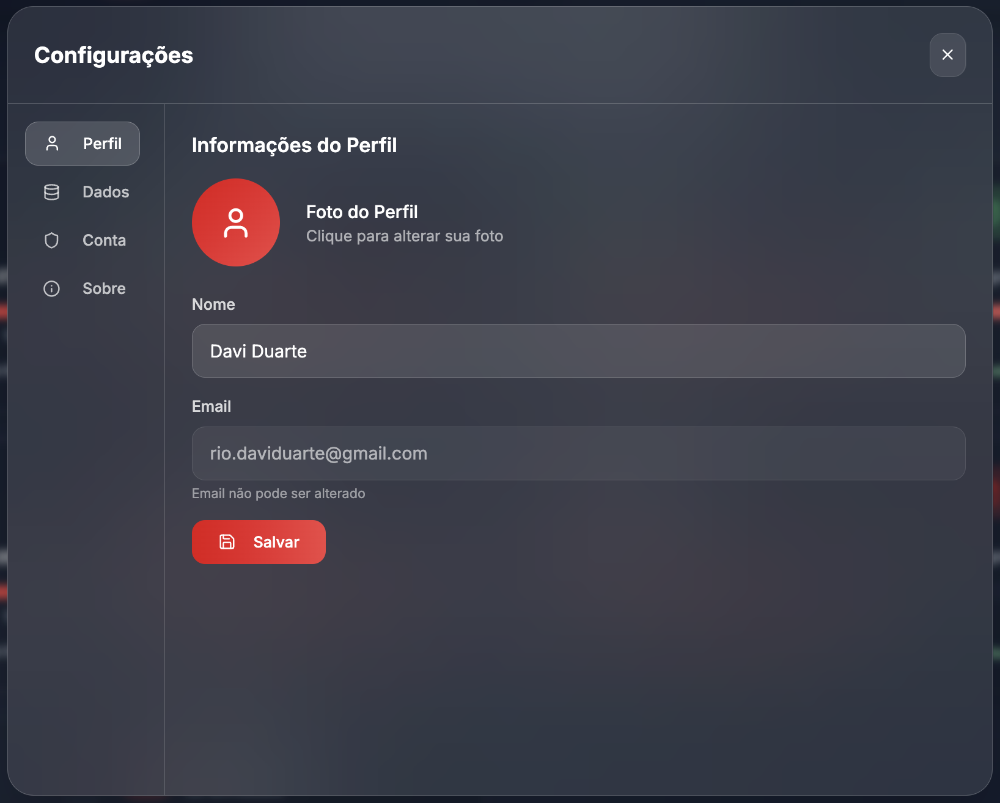

**Funcionalidade:** Modal de configurações com navegação lateral para gerenciamento de perfil e preferências do usuário.

**Features Principais:**

- Modal com design glassmorphism e proporções otimizadas
- Sidebar de navegação similar ao Figma/Notion para diferentes seções
- Seção de perfil simplificada com campos essenciais (nome, avatar, email)
- Formulários com validação em tempo real
- Botões de ação claramente definidos (salvar, cancelar)
- Design responsivo que se adapta a diferentes tamanhos de tela

**Benefícios para o Usuário:**

- Interface familiar e intuitiva para configurações
- Organização clara de diferentes tipos de configurações
- Processo simplificado de atualização de perfil
- Feedback imediato sobre mudanças realizadas

**Detalhes Técnicos:**

- Modal implementado como componente reutilizável
- Integração com APIs `GET /auth/profile` e `PUT /auth/profile`
- Gerenciamento de estado local para formulários
- Validação client-side com feedback visual
- Persistência de preferências no localStorage
- Tratamento de erros com mensagens descritivas

#### 2.7.10 Configurações de Dados

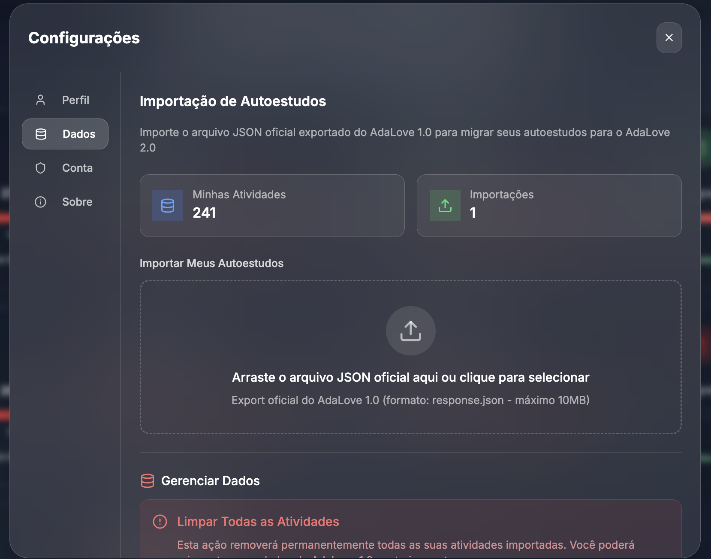

**Funcionalidade:** Seção especializada para gerenciamento de dados, incluindo importação de arquivos AdaLove 1.0 e limpeza de dados.

**Features Principais:**

- Interface de upload com drag-and-drop para arquivos JSON
- Validação rigorosa de estrutura AdaLove 1.0 (limite 10MB, MIME type)
- Processamento em background com tracking de progresso
- Histórico de importações com status detalhado
- Funcionalidade de limpeza de dados com confirmação
- Estatísticas de importação em tempo real

**Benefícios para o Usuário:**

- Importação segura e validada de dados externos
- Monitoramento transparente do processo de importação
- Controle total sobre os dados pessoais
- Recuperação fácil em caso de problemas

**Detalhes Técnicos:**

- Integração com API `POST /data/import` e rate limiting
- Componente de upload customizado com validação
- WebSocket ou polling para atualizações de status em tempo real
- Implementação de background jobs para processamento
- Sistema de auditoria para histórico de importações
- Confirmação dupla para operações destrutivas

#### 2.7.11 Arquitetura Frontend e Padrões de Design

**Tecnologias Utilizadas:**

- **Next.js 14** com App Router para estrutura da aplicação
- **React 18** com hooks modernos para gerenciamento de estado
- **Tailwind CSS** para estilização responsiva
- **Glassmorphism** como linguagem visual principal
- **Context API** para estado global da aplicação

**Padrões de Design Implementados:**

- **Design System Consistente:** Cores AdaLove (#E30614, #F24444), tipografia e espaçamentos padronizados
- **Componentes Reutilizáveis:** Cards, modais, formulários e botões com props configuráveis
- **Responsividade:** Layout adaptativo para desktop, tablet e mobile
- **Acessibilidade:** Navegação por teclado, contraste adequado e labels descritivos
- **Performance:** Lazy loading, otimização de imagens e code splitting

**Experiência do Usuário:**

- **Navegação Intuitiva:** Fluxos claros entre diferentes seções da aplicação
- **Feedback Visual:** Loading states, animações suaves e indicadores de progresso
- **Estados de Erro:** Tratamento gracioso de erros com mensagens úteis
- **Empty States:** Orientação clara quando não há dados disponíveis
- **Consistência:** Padrões visuais e comportamentais uniformes em toda a aplicação

O frontend do AdaLove 2.0 representa uma evolução significativa em relação à versão original, oferecendo uma experiência moderna, intuitiva e eficiente para gestão de atividades acadêmicas. A implementação cuidadosa dos princípios de design e a integração robusta com o backend garantem uma aplicação confiável e agradável de usar.

---

## <a name="c3"></a>3. Desenvolvimento da Aplicação Web (Semana 8)

### 3.1 Demonstração do Sistema Web (Semana 8)

*VIDEO: Insira o link do vídeo demonstrativo nesta seção*
*Descreva e ilustre aqui o desenvolvimento do sistema web completo, explicando brevemente o que foi entregue em termos de código e sistema. Utilize prints de tela para ilustrar.*

### 3.2 Conclusões e Trabalhos Futuros (Semana 8)

*Indique pontos fortes e pontos a melhorar de maneira geral.*
*Relacione também quaisquer outras ideias que você tenha para melhorias futuras.*

## <a name="c4"></a>4. Referências

*Incluir as principais referências de seu projeto, para que o leitor possa consultar caso ele se interessar em aprofundar.*<br>

---
