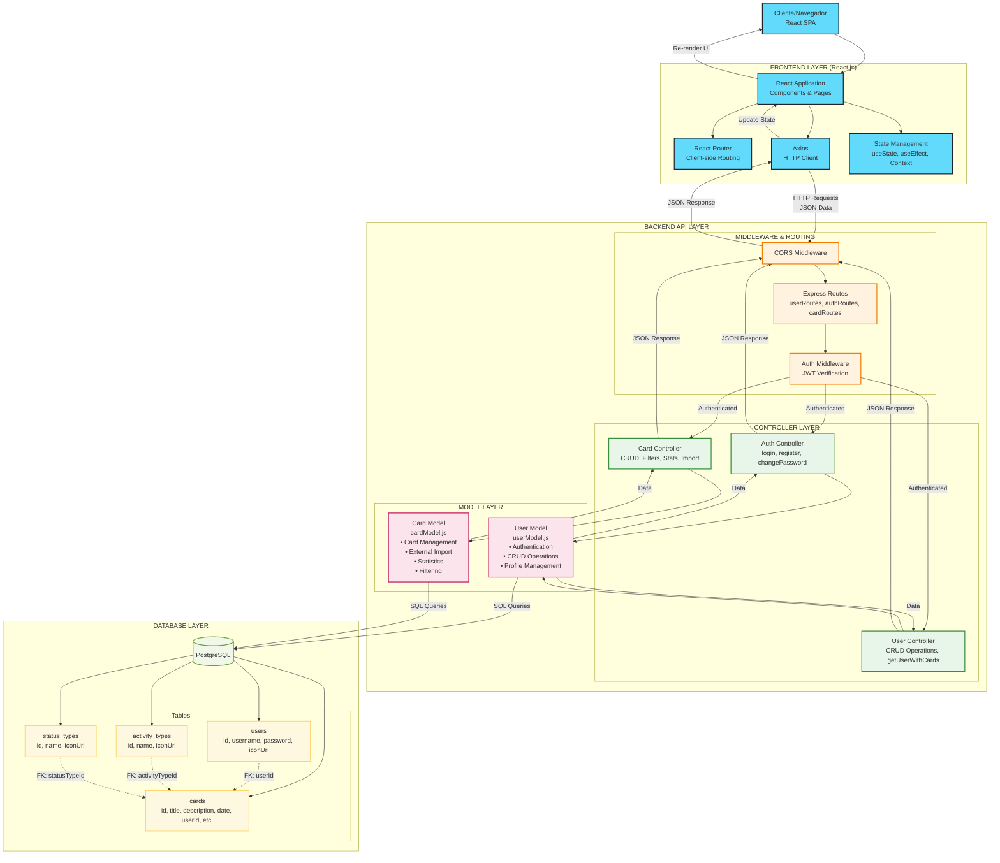

# Web Application Document - Projeto Individual - Módulo 2 - Inteli


## AdaLove Reimaginated

#### Davi Duarte - Ciência da Computação

## Sumário

1. [Introdução](#c1)  
2. [Projeto Técnico da Aplicação Web](#c2)  
3. [Desenvolvimento da Aplicação Web](#c3)  
4. [Referências](#c4)  

## <a name="c1"></a>1. Introdução

Este projeto é uma aplicação web para gerenciamento de cards de atividades do AdaLove, desenvolvido utilizando Node.js com Express.js como framework e PostgreSQL como banco de dados relacional, seguindo o padrão MVC (Model-View-Controller).

A aplicação AdaLove Reimaginated é uma plataforma para gerenciar cartões de atividades de aprendizado de forma prática e eficiente. O sistema permite que alunos do Inteli importem seus cartões de atividades e os gerenciem de uma forma mais simplificada, categorizando-os por tipo, status, instrutor e outras propriedades relevantes.

---

## <a name="c2"></a>2. Projeto da Aplicação Web

A arquitetura do sistema AdaLove Reimaginated segue o padrão MVC (Model-View-Controller), permitindo uma separação clara de responsabilidades e facilitando a manutenção e escalabilidade da aplicação.

### 2.1. Modelagem do banco de dados

A modelagem do banco de dados é o processo de criar uma representação estruturada das informações que serão armazenadas em um sistema de banco de dados. Este processo envolve a identificação das entidades principais, seus atributos e os relacionamentos entre elas, resultando em um esquema que serve como plano para a implementação física do banco de dados.

O modelo relacional do banco de dados da aplicação AdaLove Reimaginated foi projetado para permitir um gerenciamento eficiente das atividades de aprendizado e suas relações com usuários, instrutores e áreas de conhecimento. A estrutura do banco foi implementada usando PostgreSQL e segue os princípios de normalização para evitar redundâncias e garantir a integridade dos dados.

O diagrama abaixo apresenta a estrutura completa do banco de dados com todas as tabelas e seus relacionamentos:

#### Diagrama do banco no dbdiagram.io

<div align="center">
  <sup>Figura 1 - Diagrama do Banco de Dados no dbdiagram.io</sup>
  
  <sup>Fonte: Autoria própria, 2025</sup>
</div>

#### Diagrama do banco no supabase

<div align="center">
  <sup>Figura 2 - Diagrama do Banco de Dados no Supabase</sup>
  
  <sup>Fonte: Autoria própria, 2025</sup>
</div>

Deixei também o modelo do banco de dados no formato **DBML** disponível no arquivo [database-structure.dbml](/documentos/assets/database-structure.dbml)

##### Resumo da Estrutura

- **Users**: Armazena logins e informações dos usuários
- **Cards**: Armazena os cartões de atividades da adalove
- **Activity Types**: Tipos de atividades (Auto Estudo / Avaliação e Pesquisa / Desenvolvimento de Projetos / Outros)
- **Status Types**: Status possíveis para os cartões (A Fazer / Fazendo / Feito)

##### Relações

- Um usuário pode ter vários cartões
- Cada cartão tem um tipo de atividade
- Cada cartão tem um status

### 2.1.1 BD e Models

A camada de Models em uma aplicação MVC (Model-View-Controller) é responsável por gerenciar os dados, a lógica e as regras de negócio da aplicação. Ela representa a estrutura de dados subjacente e fornece métodos para interagir com o banco de dados de forma organizada e eficiente. No sistema AdaLove Reimaginated, os models implementados servem como intermediários entre as operações do controlador e o banco de dados PostgreSQL.

Os models são fundamentais para garantir o encapsulamento da lógica de acesso a dados, fornecendo uma API limpa e consistente para o restante da aplicação. Além disso, eles permitem que alterações na estrutura do banco de dados sejam isoladas, minimizando o impacto em outras partes do código.

#### Models Implementados

##### User Model

O `userModel.js` gerencia todas as operações relacionadas aos usuários da aplicação, incluindo:

- **Operações CRUD básicas**: Métodos para criar, ler, atualizar e excluir registros de usuários
- **Autenticação**: Verificação de credenciais de login
- **Relacionamentos**: Recuperação de usuários com seus respectivos cartões associados
- **Gerenciamento de perfil**: Atualização de senha e ícone de perfil

Este model encapsula tanto atributos simples (username, password) quanto relacionamentos mais complexos, como a ligação entre usuários e seus cartões de atividades.

##### Card Model

O `cardModel.js` é responsável pelo gerenciamento dos cartões de atividades, fornecendo:

- **Operações CRUD**: Criação, leitura, atualização e exclusão de cards
- **Filtragem avançada**: Busca de cards com múltiplos critérios (status, tipo, data)
- **Importação de dados externos**: Conversão de dados da plataforma AdaLove oficial para o formato interno
- **Estatísticas**: Agregação de informações sobre cartões (total, por status, obrigatórios)
- **Relacionamentos**: Associação com usuários, tipos de atividades e status

Este model implementa lógica complexa para classificação e manipulação de cartões, incluindo operações em lote para importação de dados externos.

#### Funcionalidades Destacadas

##### No User Model:

- **getUserWithCards**: Recupera um usuário junto com todos os seus cartões associados em uma única consulta otimizada, incluindo informações relacionadas como instrutores e tipos de atividades.

- **Gerenciamento de autenticação**: Métodos específicos para verificar credenciais e gerenciar senhas.

##### No Card Model:

- **importFromExternalSource**: Funcionalidade sofisticada que mapeia dados externos para o formato interno do sistema, criando automaticamente tipos de atividade quando necessário.
- **getCardsByFilters**: Sistema flexível de filtragem que suporta múltiplos critérios e ordenação personalizada.
- **getCardStats**: Agregação de estatísticas sobre cartões para análise rápida do progresso do usuário.

Os models implementados seguem boas práticas de programação, como encapsulamento de lógica de negócios, separação de responsabilidades e consultas SQL parametrizadas para prevenir injeções SQL. Esta abordagem estruturada facilita a manutenção, extensão e teste do sistema, além de proporcionar uma base sólida para a expansão futura das funcionalidades.

### 2.2. Arquitetura

A arquitetura do sistema AdaLove Reimaginated segue o padrão MVC (Model-View-Controller) adaptado para uma aplicação web moderna com frontend e backend separados. O backend utiliza Node.js com Express.js seguindo o padrão MVC tradicional, enquanto o frontend é uma Single Page Application (SPA) desenvolvida em React.js que consome a API REST do backend. Esta arquitetura promove a separação de responsabilidades em camadas distintas, tornando o código mais organizado, reutilizável e manutenível.

#### Diagrama de Arquitetura MVC



#### Explicação do Fluxo de Dados

1. **Frontend React Application**

- O usuário interage com a interface React.js no navegador
- React Router gerencia a navegação client-side entre as diferentes páginas
- Estado da aplicação é gerenciado através de hooks do React (useState, useEffect, Context)

2. **Comunicação Frontend-Backend**

- Axios é utilizado para fazer requisições HTTP para a API REST do backend
- As requisições são feitas em formato JSON
- JWT tokens são enviados nos headers para autenticação

3. **Middleware e Roteamento (Backend)**

- CORS middleware permite requisições cross-origin do frontend React
- Middleware de autenticação verifica tokens JWT antes de processar as requisições
- Sistema de rotas do Express direciona para os controladores apropriados

4. **Controladores (Backend)**

- Os controladores recebem as requisições roteadas e são responsáveis por:
- Extrair e validar dados da requisição
- Coordenar a interação entre o Model e a View
- Implementar a lógica de negócio específica da aplicação

5. **Models (Backend)**

- Os Models encapsulam todas as operações relacionadas aos dados:
  - Comunicação com o banco de dados PostgreSQL
  - Implementação das regras de negócio associadas aos dados
  - Validação de dados antes da persistência
  - Transformação de dados entre o formato do banco e o formato da aplicação

6. **Banco de Dados**

- O PostgreSQL armazena todos os dados persistentes da aplicação
- As tabelas principais incluem: Users, Cards, Activity Types e Status Types

7. **Resposta ao Cliente**

- Após processar a requisição e interagir com o modelo, o controlador:
  - Para requisições de API: formata e envia respostas JSON
  - Para requisições web: renderiza views HTML ou redireciona o usuário
- A resposta é então enviada de volta ao cliente

#### Componentes Principais

##### Frontend (React.js)

- **React Components**: Componentes reutilizáveis para interface do usuário
- **React Router**: Roteamento client-side para navegação SPA
- **Axios**: Cliente HTTP para comunicação com a API
- **State Management**: Gerenciamento de estado local e global da aplicação

##### Models

- **User Model**: Gerencia operações relacionadas aos usuários
- **Card Model**: Gerencia operações relacionadas aos cartões de atividades

##### Backend (Node.js/Express)

- **Auth Controller**: Gerencia autenticação e autorização
- **User Controller**: Operações CRUD de usuários e relacionamentos
- **Card Controller**: Gerenciamento completo de cartões, filtros e estatísticas

##### Vantagens desta Arquitetura

- **Separação Frontend-Backend**: Permite desenvolvimento independente das camadas
- **Reutilização**: API REST pode ser consumida por diferentes tipos de clientes
- **Escalabilidade**: Frontend e backend podem ser escalados independentemente
- **Manutenibilidade**: Responsabilidades bem definidas facilitam manutenção
- **Performance**: SPA proporciona experiência de usuário mais fluida
- **Flexibilidade**: Possibilita futuras integrações com mobile apps ou outras interfaces

---

Esta arquitetura proporciona uma separação clara de responsabilidades, facilitando o desenvolvimento, teste e manutenção do sistema. A estrutura modular também permite que cada componente evolua independentemente, desde que as interfaces entre eles permaneçam consistentes.

### 2.3. WebAPI e endpoints

A API do AdaLove Reimaginated fornece uma interface RESTful para interagir com o sistema, permitindo operações como gerenciamento de usuários, autenticação e manipulação de cartões de atividades. Abaixo estão detalhados todos os endpoints disponíveis, agrupados por área funcional.

#### Endpoints de Autenticação

| Método | Endpoint | Descrição | Protegido por login |
|--------|----------|-----------|-----------|
| `POST` | `/auth/login` | Autentica um usuário e retorna um token JWT | ❌ |
| `POST` | `/auth/register` | Cria um novo usuário no sistema | ❌ |
| `POST` | `/auth/change-password` | Altera a senha do usuário autenticado | ✅ |

#### Detalhes dos Endpoints de Autenticação

##### `POST /auth/login`

- **Descrição**: Autentica um usuário com base no nome de usuário e senha
- **Body**:

  ```json
  {
    "username": "string",
    "password": "string"
  }
  ```

- **Resposta (200)**:

  ```json
  {
    "message": "Authentication successful",
    "token": "string",
    "user": {
      "id": "number",
      "username": "string",
      "iconUrl": "string"
    }
  }
  ```

- **Resposta (401)**: Credenciais inválidas
- **Resposta (400)**: Campos obrigatórios não fornecidos  

##### `POST /auth/register`

- **Descrição**: Registra um novo usuário no sistema
- **Body**:

  ```json
  {
    "username": "string",
    "password": "string",
    "iconUrl": "string" (opcional)
  }
  ```

- **Resposta (201)**:

  ```json
  {
    "message": "User registered successfully",
    "user": {
      "id": "number",
      "username": "string",
      "iconUrl": "string"
    }
  }
  ```

- **Resposta (409)**: Nome de usuário já existe
- **Resposta (400)**: Campos obrigatórios não fornecidos  

##### `POST /auth/change-password`

- **Descrição**: Altera a senha do usuário autenticado
- **Autenticação**: Requer token JWT válido
- **Body**:
  
  ```json
  {
    "oldPassword": "string",
    "newPassword": "string"
  }
  ```

- **Resposta (200)**:
  
  ```json
  {
    "message": "Password updated successfully"
  }
  ```

- **Resposta (401)**: Senha antiga incorreta ou token inválido
- **Resposta (400)**: Campos obrigatórios não fornecidos

#### Endpoints de Usuários

| Método | Endpoint | Descrição | Protegida por API Key |
|--------|----------|-----------|-----------|
| `GET` | `/users` | Obtém todos os usuários | ❌ |
| `GET` | `/users/:id` | Obtém um usuário específico por ID | ❌ |
| `POST` | `/users` | Cria um novo usuário | ✅ |
| `PUT` | `/users/:id` | Atualiza um usuário existente | ✅ |
| `DELETE` | `/users/:id` | Remove um usuário | ✅ |
| `GET` | `/users/:id/cards` | Obtém um usuário com todos os seus cartões | ✅ |
| `PATCH` | `/users/:id/icon` | Atualiza apenas o ícone de um usuário | ✅ |

##### `GET /users`

- **Descrição**: Retorna uma lista de todos os usuários
- **Autenticação**: Requer token JWT válido
- **Resposta (200)**:
  
  ```json
  [
    {
      "id": "number",
      "username": "string",
      "iconUrl": "string"
    }
  ]
  ```

##### `GET /users/:id`

- **Descrição**: Retorna os detalhes de um usuário específico
- **Autenticação**: Requer token JWT válido
- **Parâmetros**:
  - `id` (path): ID do usuário
- **Resposta (200)**:
  
  ```json
  {
    "id": "number",
    "username": "string",
    "iconUrl": "string"
  }
  ```

- **Resposta (404)**: Usuário não encontrado

##### `GET /users/:id/cards`

- **Descrição**: Retorna um usuário com todos os seus cartões associados
- **Autenticação**: Requer token JWT válido
- **Parâmetros**:
  - `id` (path): ID do usuário
- **Resposta (200)**:
  
  ```json
  {
    "id": "number",
    "username": "string",
    "iconUrl": "string",
    "cards": [
      {
        "id": "number",
        "title": "string",
        "description": "string",
        "date": "string (ISO date)",
        "statusName": "string",
        "statusIconUrl": "string",
        "activityTypeName": "string",
        "activityTypeIconUrl": "string",
        "instructorName": "string"
      }
    ]
  }
  ```

- **Resposta (404)**: Usuário não encontrado

##### `PATCH /users/:id/icon`

- **Descrição**: Atualiza apenas o ícone de um usuário
- **Autenticação**: Requer token JWT válido
- **Parâmetros**:
  - `id` (path): ID do usuário
- **Body**:
  
  ```json
  {
    "iconUrl": "string"
  }
  ```

- **Resposta (200)**:

  ```json
  {
    "id": "number",
    "username": "string",
    "iconUrl": "string"
  }
  ```

- **Resposta (404)**: Usuário não encontrado

#### Endpoints de Cartões (Cards)

Estes endpoints servem para os usuários buscarem os cards que tem associados as suas contas

| Método | Endpoint | Descrição |
|--------|----------|-----------|
| `GET` | `/cards` | Obtém cartões com base em filtros |
| `GET` | `/cards/stats` | Obtém estatísticas dos cartões do usuário |
| `GET` | `/cards/:id` | Obtém um cartão específico por ID |
| `POST` | `/cards/import` | Importa cards da AdaLove 1 |

##### `GET /cards`

- **Descrição**: Retorna cartões com base em vários filtros
- **Autenticação**: Requer token JWT válido
- **Parâmetros de Consulta** (todos opcionais):
  - `userId`: Filtra por ID do usuário
  - `activityTypeId`: Filtra por tipo de atividade
  - `statusTypeId`: Filtra por tipo de status
  - `mandatory`: Filtra por obrigatoriedade (true/false)
  - `weekNumber`: Filtra por número da semana
  - `instructorName`: Filtra por nome do instrutor
  - `dateFrom`: Filtra por data inicial (ISO date)
  - `dateTo`: Filtra por data final (ISO date)
  - `search`: Termo de busca geral
  - `orderBy`: Campo para ordenação
  - `orderDirection`: Direção da ordenação (ASC/DESC)
  - `limit`: Limite de registros retornados

- **Resposta (200)**:

  ```json
  [
    {
      "id": "number",
      "title": "string",
      "description": "string",
      "date": "string (ISO date)",
      "statusTypeId": "number",
      "statusName": "string",
      "statusIconUrl": "string",
      "activityTypeId": "number",
      "activityTypeName": "string",
      "activityTypeIconUrl": "string",
      "userId": "number",
      "ownerUsername": "string",
      "instructorName": "string",
      "mandatory": "boolean",
      "weekNumber": "number"
    }
  ]
  ```

##### `GET /cards/stats`

- **Descrição**: Retorna estatísticas sobre os cartões do usuário autenticado
- **Autenticação**: Requer token JWT válido
- **Resposta (200)**:

  ```json
  {
    "total": "number",
    "byStatus": {
      "todo": "number",
      "doing": "number",
      "done": "number"
    },
    "mandatory": "number",
    "optional": "number",
    "byActivityType": {
      "studyType": "number",
      "researchType": "number",
      "projectType": "number",
      "otherType": "number"
    }
  }
  ```

##### `PATCH /cards/:id/status`

- **Descrição**: Atualiza apenas o status de um cartão
- **Autenticação**: Requer token JWT válido
- **Parâmetros**:
  - `id` (path): ID do cartão
- **Body**:
  
  ```json
  {
    "statusTypeId": "number"
  }
  ```

- **Resposta (200)**:

  ```json
  {
    "id": "number",
    "title": "string",
    "statusTypeId": "number",
    "statusName": "string"
  }
  ```

- **Resposta (404)**: Cartão não encontrado
- **Resposta (400)**: Campo statusTypeId não fornecido

##### `POST /cards/import`

- **Descrição**: Importa múltiplos cartões de uma fonte externa
- **Autenticação**: Requer token JWT válido
- **Body**:
  
  ```json
  {
    "cards": [
      {
        "title": "string",
        "description": "string",
        "type": "string",
        "status": "string",
        "date": "string (ISO date)",
        "instructorName": "string",
        "mandatory": "boolean",
        "weekNumber": "number"
      }
    ]
  }
  ```

- **Resposta (201)**:

  ```json
  {
    "message": "string",
    "importedCount": "number",
    "cards": ["array of imported card objects"]
  }
  ```

- **Resposta (400)**: Dados de importação inválidos

#### Segurança

Todos os endpoints, exceto `/auth/login` e `/auth/register`, requerem autenticação via token JWT. O token deve ser incluído no cabeçalho da requisição no formato:

```txt
Authorization: Bearer <token>
```

As respostas de erro seguem um formato consistente:

```json
{
  "error": "Mensagem descritiva do erro",
  "message": "Detalhe adicional opcional"
}
```

#### Códigos de status HTTP são utilizados de forma adequada:

- **200**: Sucesso
- **201**: Recurso criado
- **400**: Requisição inválida
- **401**: Não autorizado
- **404**: Recurso não encontrado
- **409**: Conflito
- **500**: Erro interno do servidor

Esta API fornece uma interface completa para gerenciar todos os aspectos do sistema AdaLove 2, permitindo operações robustas de CRUD para usuários e cartões, além de funcionalidades especializadas como importação de dados e análise estatística.

### 2.7 Interface e Navegação (Semana 07)

*Descreva e ilustre aqui o desenvolvimento do frontend do sistema web, explicando brevemente o que foi entregue em termos de código e sistema. Utilize prints de tela para ilustrar.*

---

## <a name="c3"></a>3. Desenvolvimento da Aplicação Web (Semana 8)

### 3.1 Demonstração do Sistema Web (Semana 8)

*VIDEO: Insira o link do vídeo demonstrativo nesta seção*
*Descreva e ilustre aqui o desenvolvimento do sistema web completo, explicando brevemente o que foi entregue em termos de código e sistema. Utilize prints de tela para ilustrar.*

### 3.2 Conclusões e Trabalhos Futuros (Semana 8)

*Indique pontos fortes e pontos a melhorar de maneira geral.*
*Relacione também quaisquer outras ideias que você tenha para melhorias futuras.*


## <a name="c4"></a>4. Referências

_Incluir as principais referências de seu projeto, para que o leitor possa consultar caso ele se interessar em aprofundar._<br>

---